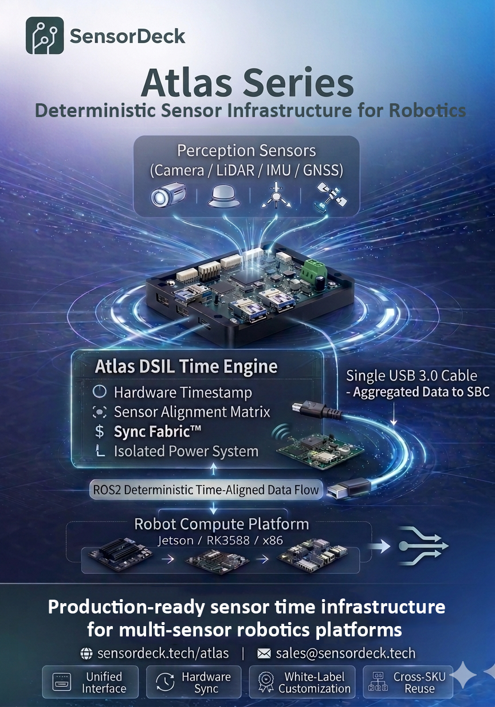

# Atlas Developer Documentation

### Atlas provides a deterministic sensor backbone and timing authority for multi-sensor robotics systems.

---

Atlas establishes a unified sensor infrastructure by providing:

• **Time Authority** — a single hardware timestamp authority for all sensors  
• **Single-Cable Aggregation** — multiple sensors aggregated into one upstream link  
• **Cross-SKU Standardization** — one sensor infrastructure reused across robot platforms  

Atlas converts sensor integration from **custom engineering work** into **deployable infrastructure**.

---

## Atlas in One Diagram

**Atlas deterministic sensor backbone architecture**

Sensors connect to Atlas -> Atlas synchronizes and aggregates them -> The robot compute platform receives a unified sensor pipeline

**This architecture addresses common robotics integration challenges:**

• Timestamp drift between sensors  
• Unstable perception pipelines  
• Repeated sensor interface board development  
• Complex wiring harnesses  
• Difficult debugging of asynchronous sensor systems

---

# What Atlas Solves

Modern robots integrate many independent sensors:

• cameras  
• LiDAR  
• IMU  
• GNSS  
• trigger signals  

These sensors use different interfaces:

• USB  
• Ethernet  
• SPI  
• UART  

Each sensor typically runs on its own clock and timing model.

This leads to common robotics problems:

• sensor timestamp drift  
• perception jitter  
• unstable sensor fusion  
• repeated integration work across robot platforms  

Engineering teams often spend **months building custom infrastructure** just to make sensors work together reliably.

Atlas exists to eliminate this repeated work.

---

# Atlas Core Principles

Atlas is designed around three engineering principles.

### Time Authority

Atlas provides a **hardware timestamp authority** for all connected sensors.

Instead of relying on independent device clocks, Atlas creates a deterministic timing boundary before sensor data enters the compute platform.

This significantly reduces cross-sensor time drift and simplifies perception pipelines.

---

### Single-Cable Sensor Aggregation

Atlas aggregates multiple sensors into a **single upstream connection** to the robot compute platform.

Instead of connecting sensors individually to the SBC, Atlas acts as a dedicated sensor backbone.

Benefits include:

• reduced cable harness complexity  
• simplified sensor integration  
• cleaner system architecture  

---

### Cross-Platform Sensor Standardization

Robotics companies often build multiple robot models.

Without a standardized sensor infrastructure, integration work must be repeated for each platform.

Atlas provides a reusable sensor infrastructure layer that can be deployed across multiple robot SKUs.

This allows engineering teams to scale robot development more efficiently.

---

# Atlas System Boundary

Atlas focuses exclusively on **perception sensor infrastructure**.

Sensors typically connected to Atlas include:

• cameras (UVC / USB)  
• LiDAR sensors  
• inertial measurement units (IMU)  
• GNSS receivers  
• synchronization triggers  

These sensors form the **perception domain** of a robotics system.

---

## Systems Outside Atlas Scope

Atlas intentionally does not integrate robot control systems.

Control-domain components remain connected to the robot controller or CAN bus network.

Examples include:

• motor controllers  
• motor drivers  
• wheel encoders  
• safety controllers  
• actuator feedback loops  

These systems operate inside real-time control loops and remain independent from the Atlas infrastructure.

---

# Atlas Domain Model

Robotics systems using Atlas are typically organized into four domains.

| Domain | Responsibility |
|------|------|
| **Perception Domain** | Cameras, LiDAR, IMU, GNSS and other sensors |
| **Atlas Infrastructure** | Sensor aggregation and timestamp authority |
| **Compute Domain** | Robot compute platform (Jetson / ARM SBC / x86) |
| **Control Domain** | Motor control, CAN bus networks, safety controllers |

Atlas provides the **deterministic sensor infrastructure** between the perception domain and the compute domain.

---

# Internal Development vs Atlas

Many robotics teams initially attempt to build their own sensor infrastructure.

Typical internal effort:

| Task | Typical Effort |
|-----|-----|
| Interface board design | 1–2 months |
| Sensor synchronization debugging | 1–2 months |
| Driver integration | 1 month |
| System validation | 1–2 months |

Total engineering investment can easily reach **4–9 months**.

Atlas provides a production-ready sensor infrastructure so teams can focus on:

• perception algorithms  
• robot navigation  
• autonomy software  

instead of building sensor integration platforms.

---

# Atlas Evaluation Kit

Atlas can be evaluated using a minimal sensor configuration.

Typical evaluation setup:

• USB camera  
• USB LiDAR  
• IMU sensor  
• GNSS receiver  

Evaluation workflow:

1. connect sensors to the Atlas evaluation kit  
2. connect Atlas to the robot compute platform  
3. run DSIL telemetry pipeline  
4. observe synchronized sensor output  

Evaluation typically requires **less than 30 minutes**.

---

# Documentation Sections

The Atlas documentation is organized into the following sections.

### Hardware Architecture

Atlas hardware platform design and sensor aggregation architecture.

### DSIL SDK

Deterministic Sensor Integration Layer software stack.

### ROS2 Integration

How Atlas integrates with ROS2 perception pipelines.

### Sensor Synchronization

Technical explanation of the Atlas timestamp alignment pipeline.

### Evaluation Kit Setup

Step-by-step instructions for deploying the Atlas evaluation system.

---

# Start Exploring

To understand how Atlas works internally, begin with the **Hardware Architecture** documentation.

Atlas is designed to make multi-sensor robotics systems easier to build, scale, and maintain.

